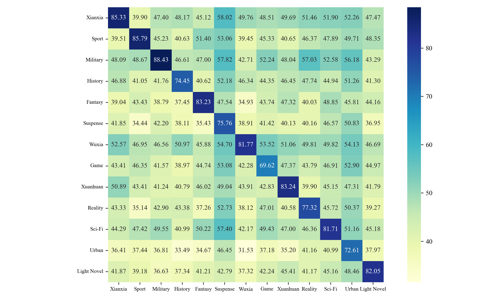
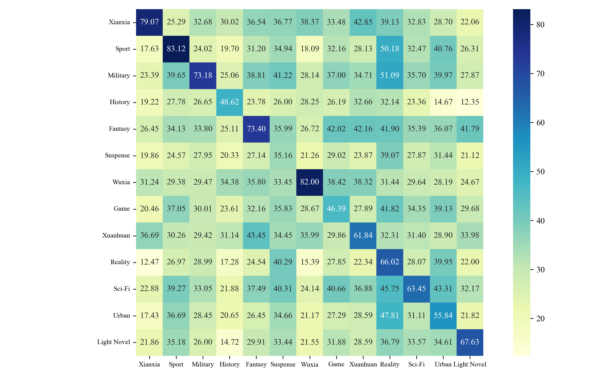

[**中文**](./README.md) | [**English**](./README_EN.md)


# 多体裁中文小说命名实体识别语料库


我们的发表在 PACLIC2023 

## 概述 

为了推动文学 NER 的研究，我们建立了多体裁文学 NER 语料库，其中包含 260 部网络中文小说中的 105,851 句话中的 263,135 个实体，这些小说涵盖 13 个不同的体裁。

基于该语料库，我们研究了不同体裁实体的特征。我们实现了几种基线 NER 模型，并进行了跨体裁和跨领域的实验。实验结果表明，体裁差异对 NER 性能有显著影响，尽管不如文学领域和新闻领域等领域差异那么大。

更多关于我们工作的详细信息，请参阅我们的论文：[A Corpus for Named Entity Recognition in Chinese Novels with Multi-genres](https://aclanthology.org/2023.paclic-1.39/)。

## 更新 

- [x] [2024/10/14] 数据已开源

## 数据 

#### 数据获取
数据来源于[起点中文网](https://www.qidian.com/)，包含仙侠、体育、军事、历史、奇幻、悬疑、武侠、游戏、玄幻、现实、科幻、都市、轻小说等13个体裁。

对于每一个体裁，我们爬取了排名前20的作品（排行榜截止于2021）。每一部作品我们选取了可以公开获取的前10章小说，所有的数据皆可以开源获取。

#### 标注规范（详见论文）

- 单字实体忽略
- 嵌套实体忽略，只标注最长的外部实体
- 实体由不带量词、代词和形容词修饰语等的中心名词组成
- 实体必须指小说中的特定实体

#### 数据统计
1. 数据集统计信息

| 实体类型 |  实体数 | 去重实体数 | 平均长度 |
| :------: | ------: | ---------: | -------: |
|   人物   | 197,597 |     17,013 |     3.64 |
|   地点   |  45,094 |      4,641 |     3.60 |
|   组织   |  20,444 |      2,804 |     4.87 |
|   总计   | 263,135 |     24,458 |     3.73 |

2. 各体裁实体统计（详见论文）

   


## 模型 

| 模型               | 链接                                                         | 说明                                              |
| ------------------ | ------------------------------------------------------------ | ------------------------------------------------- |
| roberta-bilstm-crf | [下载](https://huggingface.co/zhao73/MultiGenre-ChineseNovel) | 基于MultiGenre-ChineseNovel训练的小说实体识别模型 |


## 实验结果

1. 跨题材实验结果，左侧为Micro-F1，右侧为ORG-F1的混淆矩阵

<div align="left">
  
  
</div>


## 限制声明 

我们获取的数据皆可在起点中文网公开获取，仅用于科研用途。

## 致谢 

本项目由郑州大学[自然语言处理实验室](http://www5.zzu.edu.cn/nlp/index.htm)发起，负责同学为赵汉杰，指导老师为贾玉祥、昝红英，感谢实验室各位老师和同学们的鼎力支持以及提供的宝贵数据和算力资源。

## 引用 

如果您希望引用这个工作，请使用以下格式：

```text
@inproceedings{zhao-etal-2023-corpus,
    title = "A Corpus for Named Entity Recognition in {C}hinese Novels with Multi-genres",
    author = "Zhao, Hanjie  and
      Xie, Jinge  and
      Yan, Yuchen  and
      Jia, Yuxiang  and
      Ye, Yawen  and
      Zan, Hongying",
    editor = "Huang, Chu-Ren  and
      Harada, Yasunari  and
      Kim, Jong-Bok  and
      Chen, Si  and
      Hsu, Yu-Yin  and
      Chersoni, Emmanuele  and
      A, Pranav  and
      Zeng, Winnie Huiheng  and
      Peng, Bo  and
      Li, Yuxi  and
      Li, Junlin",
    booktitle = "Proceedings of the 37th Pacific Asia Conference on Language, Information and Computation",
    month = dec,
    year = "2023",
    address = "Hong Kong, China",
    publisher = "Association for Computational Linguistics",
    url = "https://aclanthology.org/2023.paclic-1.39",
    pages = "398--405",
}
```
